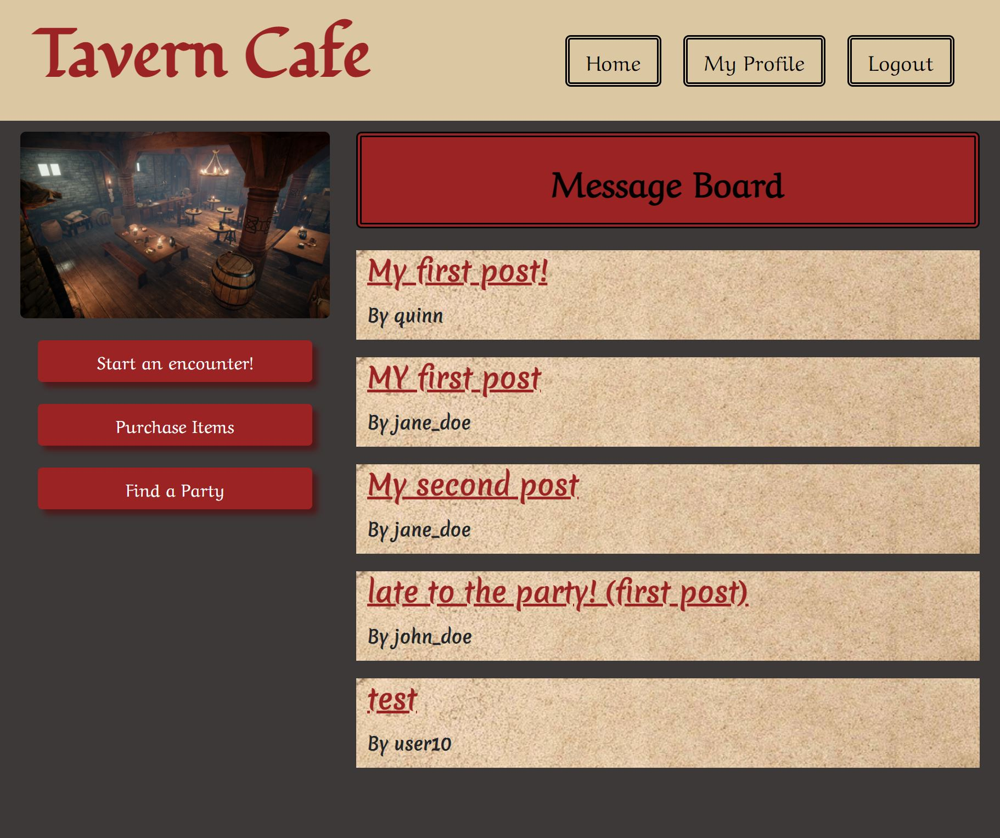

# Tavern Cafe

## Description

This is a website, where a user can log into their account and interact with other users that all share a love for RPG's.

The account would hold their character name, basic info, and a few stats.

They will then enter a lobby where they can interact (future development) with other account characters and share info about their adventures. 

The more they interact with other characters, the more social stats they will have which allow them to (future development) join a clan. 

Once a clan is formed, (future development) the clan can partake in adventures/mini-games to boost other stats.

## Installation

You can find the deployed site [here.](https://tavern-cafe.herokuapp.com/)

To install the entire project and access the code, you can clone the repository by using the command prompt

$ git clone https://github.com/BootcampAPIcons/Project2

Detailed instructions for cloning GitHub repositories can be found [here.](https://docs.github.com/en/github/creating-cloning-and-archiving-repositories/cloning-a-repository-from-github/cloning-a-repository)

## Usage

When displaying correctly, website should look like the image below:

## Credits

Trilogy Education Services, LLC, a 2U, Inc. brand

[Coding Boot Camp at UT](https://github.com/the-Coding-Boot-Camp-at-UT)

[Express-Session](https://www.npmjs.com/package/express-session)

[Express.js](https://expressjs.com/)

[Sequelize](https://sequelize.org/)

[MySQL](https://www.mysql.com/)

[Node.js](https://nodejs.org/en/)

[Express-Handlebars](https://www.npmjs.com/package/express-handlebars)

[Passport.js]()

[Bootstrap](https://getbootstrap.com/)

[Dotenv](https://www.npmjs.com/package/dotenv)

[Bcrypt](https://www.npmjs.com/package/bcrypt)

## License

MIT License

Copyright (c) 2021 Allyson McGrath

Permission is hereby granted, free of charge, to any person obtaining a copy
of this software and associated documentation files (the "Software"), to deal
in the Software without restriction, including without limitation the rights
to use, copy, modify, merge, publish, distribute, sublicense, and/or sell
copies of the Software, and to permit persons to whom the Software is
furnished to do so, subject to the following conditions:

The above copyright notice and this permission notice shall be included in all
copies or substantial portions of the Software.

THE SOFTWARE IS PROVIDED "AS IS", WITHOUT WARRANTY OF ANY KIND, EXPRESS OR
IMPLIED, INCLUDING BUT NOT LIMITED TO THE WARRANTIES OF MERCHANTABILITY,
FITNESS FOR A PARTICULAR PURPOSE AND NONINFRINGEMENT. IN NO EVENT SHALL THE
AUTHORS OR COPYRIGHT HOLDERS BE LIABLE FOR ANY CLAIM, DAMAGES OR OTHER
LIABILITY, WHETHER IN AN ACTION OF CONTRACT, TORT OR OTHERWISE, ARISING FROM,
OUT OF OR IN CONNECTION WITH THE SOFTWARE OR THE USE OR OTHER DEALINGS IN THE
SOFTWARE.
